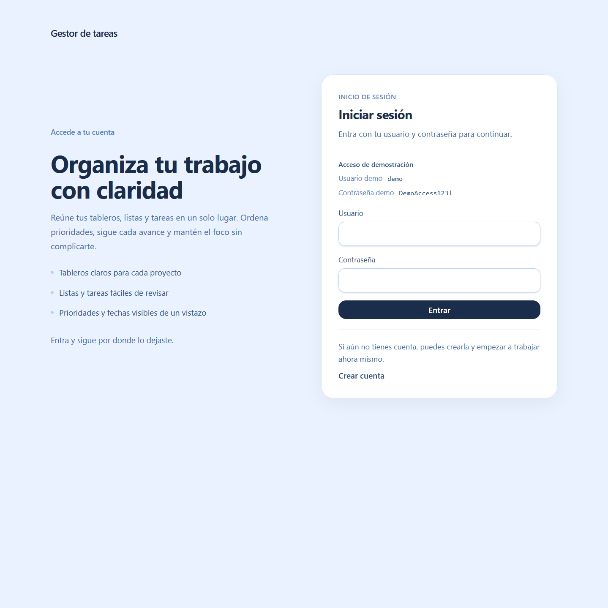
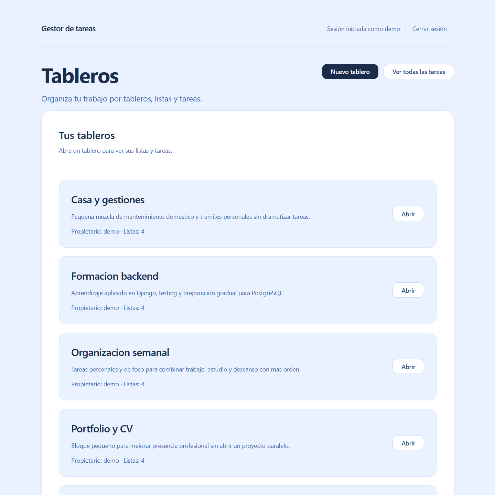
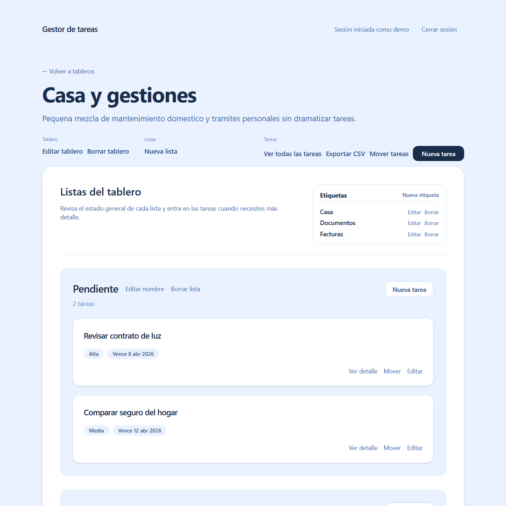
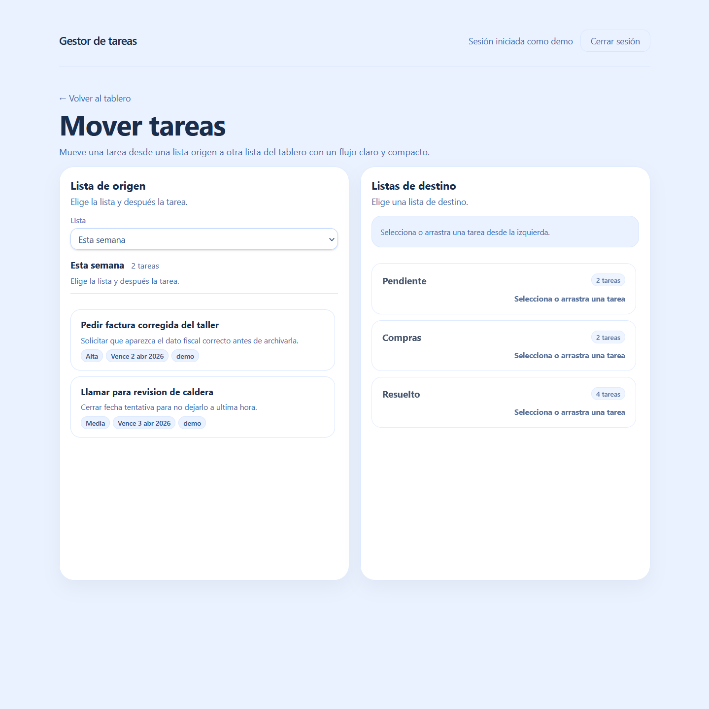

# Django Task Manager

Aplicación web de gestión de tareas construida con Django para organizar trabajo en tableros, listas y tareas dentro de una estructura tipo kanban.

**Demo en vivo:** https://task.franciscojbravo.com  
**Acceso demo:** `demo` / `DemoAccess123!`  
**Stack principal:** Python, Django, PostgreSQL, SQLite, HTML, CSS, Vanilla JavaScript

## Resumen

Django Task Manager permite a cada usuario gestionar sus propios tableros, crear listas dentro de ellos y organizar tareas con prioridad, fecha límite, etiquetas y asignación.

`board_detail` actúa como overview principal del tablero y la operación visible de mover tareas vive en una pantalla específica, con flujo por clic y también con arrastrar y soltar usando JavaScript nativo.

La aplicación está desplegada públicamente, puede probarse con acceso demo y también puede ejecutarse en local con una base de datos de ejemplo generada mediante comando.

## Vista previa

Estas son algunas vistas reales de la aplicación en su estado actual.

  
  

  
  

## Qué permite hacer

### Gestión de usuario
- registro de cuenta
- login y logout
- acceso aislado por usuario

### Organización del trabajo
- crear, editar y borrar tableros
- crear, renombrar y borrar listas dentro de cada tablero
- crear, editar y borrar tareas dentro de una lista
- revisar cada tablero desde una vista overview con acciones globales y acceso directo a tareas
- mover tareas entre listas desde una pantalla específica de movimiento
- mover tareas de forma visible con flujo por clic y también con arrastrar y soltar en Vanilla JS

### Gestión de tareas
- asignar prioridad
- añadir fecha límite
- gestionar etiquetas por tablero
- asignar tareas
- editar y eliminar tareas desde el flujo principal

### Salida y demo
- exportar tareas de un tablero a CSV
- cargar una demo reproducible con datos realistas mediante comando de siembra

## Qué incluye

- modelado relacional con entidades conectadas entre sí
- vistas y formularios renderizados en servidor
- autenticación y autorización básica por usuario
- CRUD completo sobre entidades relacionadas
- validaciones a nivel de formulario y servidor
- tests funcionales y de comportamiento
- despliegue público en producción

## Stack utilizado

- **Python**
- **Django**
- **PostgreSQL** en producción
- **SQLite** en local
- **HTML renderizado en servidor**
- **CSS propio**
- **Vanilla JavaScript** para la interacción visible de mover tareas
- **Tests con Django TestCase**

## Demo en vivo

La aplicación está disponible en:

**https://task.franciscojbravo.com**

Puedes entrar con las credenciales demo:

- **Usuario:** `demo`
- **Contraseña:** `DemoAccess123!`

## Cómo ejecutarlo en local

### 1. Clonar el repositorio

    git clone https://github.com/fjbravo75/django-task-manager.git
    cd django-task-manager

### 2. Crear y activar entorno virtual

    python -m venv .venv
    source .venv/bin/activate

En Windows:

    .venv\Scripts\activate

### 3. Instalar dependencias

    pip install -r requirements.txt

### 4. Preparar variables de entorno

Copia el archivo de ejemplo:

    cp .env.example .env

Después, ajusta los valores si lo necesitas.

### 5. Aplicar migraciones

    python manage.py migrate

### 6. Cargar demo reproducible

    python manage.py seed_demo

### 7. Levantar servidor local

    python manage.py runserver

La aplicación quedará disponible en:

`http://127.0.0.1:8000/`

## Variables de entorno

El proyecto incluye un archivo `.env.example` con la configuración base necesaria para arrancar.

Variables principales:

- `SECRET_KEY`
- `DEBUG`
- `ALLOWED_HOSTS`
- `CSRF_TRUSTED_ORIGINS`
- `DATABASE_URL`
- `DEMO_USER_PASSWORD`

En local puede funcionar con SQLite sin configuración extra. En producción está configurado para usar PostgreSQL mediante `DATABASE_URL`.

## Demo reproducible

El proyecto incluye un comando de siembra para generar una base de datos de ejemplo de forma rápida y consistente:

    python manage.py seed_demo

Este comando crea una demo con:

- 1 usuario demo
- 5 tableros
- 20 listas
- 50 tareas

Credenciales demo por defecto:

- **Usuario:** `demo`
- **Contraseña:** `DemoAccess123!`

## Decisiones de implementación

- aplicación Django renderizada en servidor
- alcance contenido y centrado en el flujo principal del producto
- movimiento visible de tareas resuelto con Vanilla JS localizado, sin frontend separado
- demo reproducible mediante comando de siembra
- despliegue público con base de datos real en producción

## Estado actual del proyecto

El proyecto está desplegado y puede probarse directamente desde la demo pública.

A día de hoy incluye:

- acceso demo visible
- despliegue operativo en producción
- base local reproducible
- estructura clara para revisión del código y prueba funcional
